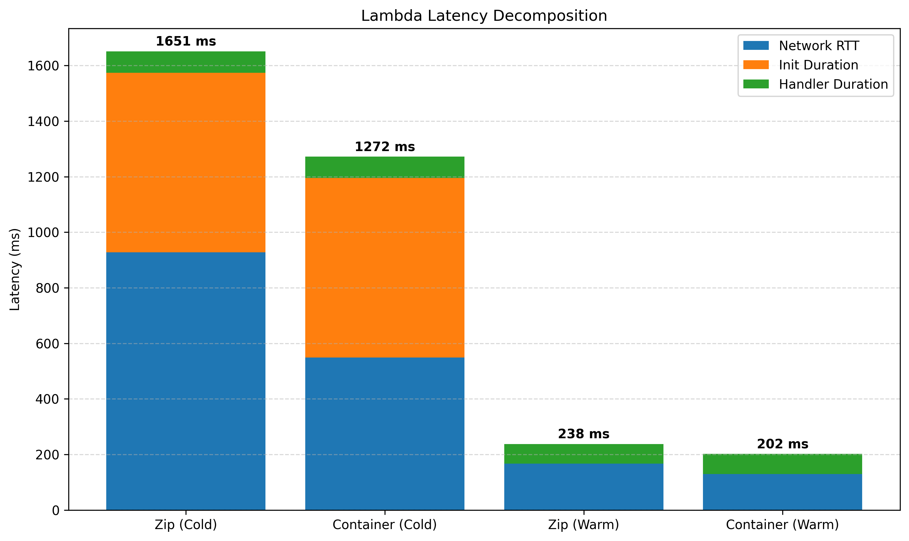
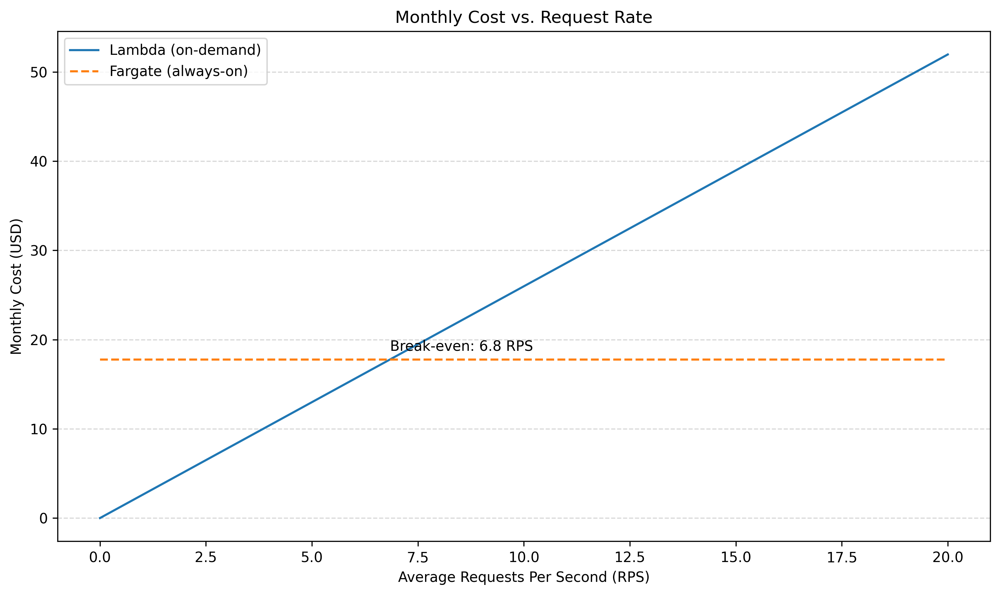

# Large Scale Computing - AWD Cloud report

This lab measures the latency and cost of three AWS execution environments — Lambda, Fargate, and EC2 — running the same workload under different traffic patterns.

## Scenario A - Cold Start

This scenario focuses on measuring and decomposing cold start latency in AWS Lambda for both zip-based and container-based deployments. Cold starts occur when a new execution environment must be initialized after a period of inactivity, introducing additional latency before the actual request handler begins execution. The goal of this scenario is to quantify how much of the total latency is attributable to initialization versus execution, and to compare the behavior of different deployment formats under identical conditions.



Container-based deployment shows faster cold start performance, with roughly ~400 ms lower latency compared to the zip-based deployment. This is likely due to reduced initialization overhead, as container images can include prebuilt dependencies and avoid some setup steps required by zip packages.

For warm invocations, the difference is much smaller (around 30 ms), indicating that both deployment types perform similarly once initialized. Overall, deployment format significantly affects cold starts but has only a minor impact on steady-state performance.

## Scenario B - Warm Steady-State Throughput

This scenario evaluates the performance of each environment under sustained load, assuming that all execution environments are already warm. It isolates steady-state behavior by removing cold start effects and focusing on how each system handles concurrency, queuing, and resource contention.

| Environment           | Concurrency | p50 (ms)  | p95 (ms)  | p99 (ms)  | Server avg (ms) |
|-----------------------|-------------|-----------|-----------|-----------|-----------------|
| Lambda (zip)          | 5           | 96.2429   | 113.4706  | 137.0296  | 96.1682         |
| Lambda (zip)          | 10          | 91.9021   | 110.1368  | 148.0473  | 88.5477         |
| Lambda (container)    | 5           | 90.9061   | 108.2386  | 135.1962  | 91.3272         |
| Lambda (container)    | 10          | 89.2154   | 106.4650  | 152.0406  | 91.4551         |
| Fargate               | 10          | 797.2     | 1008.6    | 1203.7    | 794.8           |
| Fargate               | 50          | 3981.1    | 4482.2    | 4660.0    | 3833.1          |
| EC2                   | 10          | 184.5661  | 239.8574  | 274.0274  | 182.8666        |
| EC2                   | 50          | 931.3     | 1068.5    | 1173.8    | 0905.8          |

Lambda’s p50 latency stays almost the same from concurrency 5 to 10 because each request runs in its own execution environment, so there is no waiting or resource contention. In contrast, Fargate and EC2 use fixed resources, so when concurrency increases, requests start to queue. This waiting time increases latency significantly, which is why p50 rises a lot at higher concurrency.

The difference between server-side query_time_ms and client-side p50 is due to extra time outside the application. Server-side time measures only execution, while client-side latency also includes network delay and any queueing.

## Scenario C - Burst from Zero

This scenario evaluates how each environment behaves under sudden, high-intensity traffic arriving after a period of inactivity. It highlights differences in scaling behavior, provisioning delays, and cold start effects when resources must respond quickly to a spike in demand.

| Environment           | p50 (ms)  | p95 (ms)  | p99 (ms)  | Max latency (ms)  |
|-----------------------|-----------|-----------|-----------|-------------------|
| Lambda (zip)          | 96.8      | 1286.4    | 1317.5    | 1318.3            |
| Lambda (container)    | 93.3      | 894.7     | 1084.1    | 1096.4            |
| Fargate               | 3903.3    | 4211.6    | 4333.9    | 4396.3            |
| EC2                   | 697.7     | 1617.8    | 1916.9    | 2111.1            |

Lambda’s p99 is much higher during the burst because many requests trigger cold starts after the idle period. These cold starts add initialization time, increasing latency to over 1 second. Fargate and EC2 do not have this issue since they are already running.

Lambda shows a bimodal latency distribution with two groups: fast requests (~90 ms) and slow ones (~1.1–1.3 s). The fast group represents warm invocations, while the slow group corresponds to cold starts. This creates two distinct clusters in the results.

Lambda does not meet the p99 < 500 ms requirement because some requests are slow due to cold starts. This can be improved by keeping some Lambda instances running (pre-warmed), which removes the startup delay and keeps latency low even during bursts, but increases the costs.

## Cost at Zero Load

This section analyzes the baseline cost of running each environment when there is no incoming traffic. It highlights how each pricing model behaves under idle conditions.

Traffic model assumes 18 hourse/day idle time.

AWS Lambda costs are based only on the number of invocations and the execution duration. When there is no traffic, no functions are invoked, so there are no compute or request charges. As a result, idle Lambda functions generate no cost.

AWS Fargate calculates costs based on the amount of vCPU and memory allocated to a running task, billed per second while the task is active, regardless of whether it is handling traffic or idle.

```
30 * 18 * (0.5 * $0.04048 + $0.004445) = $13.3299
```

AWS EC2 calculates costs based on the instance type and the time the instance is running, billed per hour, regardless of CPU utilization.

```
30 * 18 * $0.0208 = $11.232
```

The following table summarizes the monthly idle cost for each environment.

| Environment           | Idle cost per 30 days     |
|-----------------------|---------------------------|
| Lambda                | $0.00                     |
| Fargate               | $13.33                    |
| EC2                   | $11.23                    |

## Cost Model, Break-Even, and Recommendation

This section combines the performance measurements with a cost model to evaluate monthly expenses under a realistic traffic pattern and determine the break-even point between architectures.

Traffic model:

- Peak: 100 RPS for 30 minutes/day
- Normal: 5 RPS for 5.5 hours/day
- Idle: 18 hours/day (0 RPS)

This means 8370000 requests per month.

Using the pricing model described in the previous section, the monthly Lambda cost is calculated as follows:

```
GB-seconds/month = requests/month * duration_seconds * memory_GB = 8370000 * 0.0962429 * 0.5 = 402776.5365

Monthly cost = (requests/month * $0.20/1M) + (GB-seconds/month * $0.0000166667) = (8370000 * $0.20 / 1000000) + (402776.5365 * $0.0000166667) = $8.38695570088
```

Based on the always-on pricing model introduced earlier, the monthly Fargate cost is:

```
Monthly cost = 30 * 24 * (0.5 * $0.04048 + $0.004445) = $17.7732
```

Using the EC2 hourly rate, the monthly cost is:

```
Monthly cost = 30 * 24 * ($0.0208) = 14.976
```

The table below presents the total monthly cost for each environment under the defined traffic model, combining both active usage and idle periods.

| Environment           | Idle cost per 30 days*    |
|-----------------------|---------------------------|
| Lambda                | $8.39                     |
| Fargate               | $17.77                    |
| EC2                   | $14.98                    |

### Break-even RPS

Break-even point is found by comparing Lambda’s variable cost with Fargate’s fixed monthly cost. Lambda cost increases linearly with average request rate (RPS), while Fargate remains constant.

```
lambda_monthly_cost = fargate_monthly_cost

lambda_monthly_cost = (requests/month * $0.20/1M) + (GB-seconds/month * $0.0000166667) = (requests/month * $0.20/1M) + (requests/month * duration_seconds * memory_GB * $0.0000166667) = (30 * 24 * 60 * 60 * rps * $0.20 / 1000000) + (30 * 24 * 60 * 60 * rps * 0.0962429 * 0.5 * $0.0000166667) = rps * $2.59725079769

fargate_monthly_cost = 30 * 24 * (0.5 * $0.04048 + $0.004445) = $17.7732

rps * $2.59725079769 = $17.7732

rps = 6.84308192948
```

The average RPS would have to be around 6.84 for fargate to break-even with lambda.



### Recommendation

With SLO of p99 < 500ms and the given traffic model, the recommended environment would be Lambda (container). It has achieved p99 = 135.1962 ms for warm throughput. It's slower with coldstarts, failing the SLO , but that can be countered by provisioned concurrency. The traffic is idle for most of the day so it wouldn't generate any costs (or little costs with provisioned concurrency).

The recommendation would change if average RPS would reach the break-even point of 6.8 or duration seconds for each request increased significantly.
