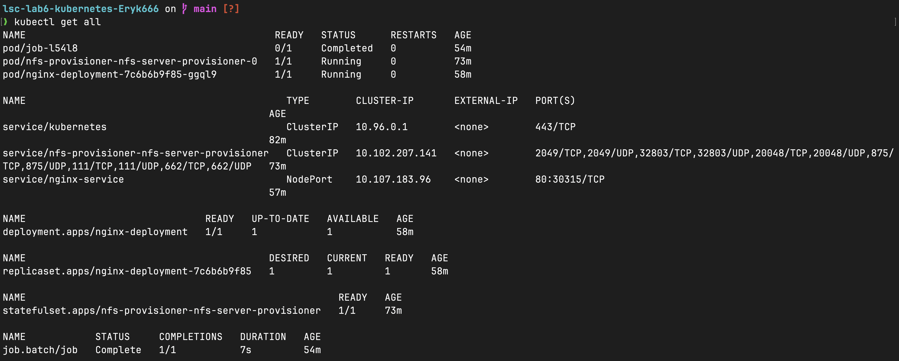
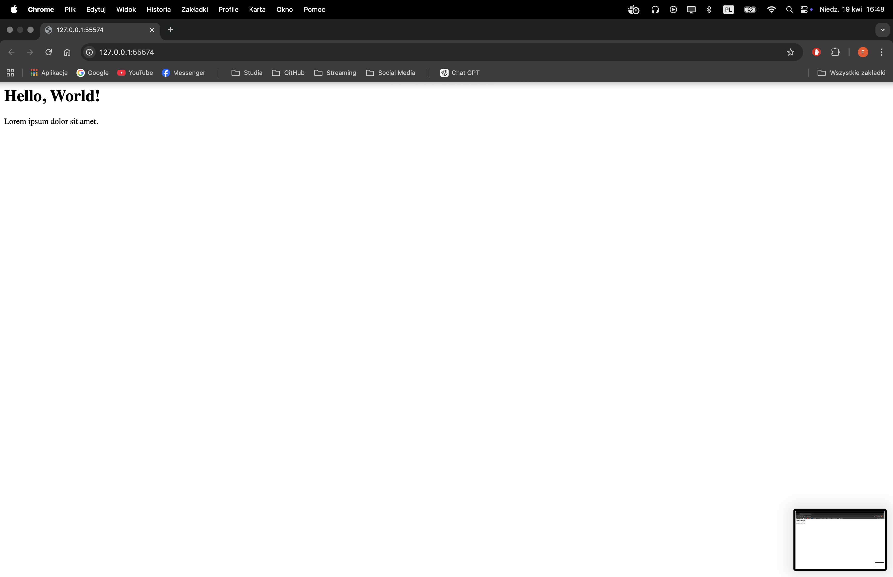

# LSC Lab 6
This project demonstrates a Kubernetes application that utilizes an NFS provisioner to manage shared persistent storage. It involves a web server (Nginx) that serves content written to a shared volume by a separate Kubernetes Job.

## Architecture
The application follows a modular architecture where storage is decoupled from the compute resources. Below is a description of the components used in this deployment and the role each plays in the system's functionality.

1. NFS Provisioner: Acts as the storage controller. It manages a local directory and exports it via the NFS protocol to other pods in the cluster. It also monitors for PVCs requesting the "nfs-lsc" storage class.

2. Persistent Volume Claim: A request for storage. It acts as the bridge between the pods and the underlying NFS storage.

3. Content Loader Job: A short-lived task. It mounts the PVC, writes a sample "index.html" file to the shared directory, and then completes.

4. Nginx Deployment: The persistent web server. It mounts the same PVC to its webroot directory. Because it shares the NFS volume with the Job, it can serve the "index.html" file created by the Job.

5. Nginx Service: A NodePort service that provides a stable network endpoint to access the Nginx pod.

## Commands to Run the Application
The following steps were executed using kubectl, helm, and minikube to provision the infrastructure and deploy the application.

### 1. Cluster Initialization
The environment was initialized using Minikube, which provisions a local Kubernetes cluster.

```sh
minikube start --driver=docker
```

### 2. Storage Provisioning
The NFS infrastructure was deployed via Helm. The storageClass.name was explicitly defined during installation to ensure compatibility with the application's Persistent Volume Claims.

```sh
helm repo add nfs-ganesha-server-and-external-provisioner https://kubernetes-sigs.github.io/nfs-ganesha-server-and-external-provisioner/
helm repo update
helm install nfs-provisioner nfs-ganesha-server-and-external-provisioner/nfs-server-provisioner --set storageClass.name=nfs-lsc --set storageClass.defaultClass=false
```

### 3. Application Deployment
The core components (PVC, Service, Deployment, and Job) were applied to the cluster using the following manifests:

```sh
kubectl apply -f nfs-pvc.yaml
kubectl apply -f web-deployment.yaml
kubectl apply -f web-service.yaml
kubectl apply -f content-loader-job.yaml
```

### 4. Service Exposure
Once the deployment was finalized, the internal Nginx service was exposed to the host machine's network. This allowed for external verification that the HTTP server was correctly routing traffic and serving the content stored on the NFS volume.

```sh
minikube service nginx-service
```

## Results
To verify the successful orchestration of all components, the following outputs were captured:

### Cluster Resource Status
The output below confirms that the Nginx deployment is scaled, the NFS provisioner is active, and the data-loading Job has reached a Completed status.



### Running application
By accessing the Nginx service via the Minikube tunnel, the web browser displays the content written to the NFS volume by the Job. This confirms that the Nginx pod successfully mounted the dynamic PV and read the shared data.



